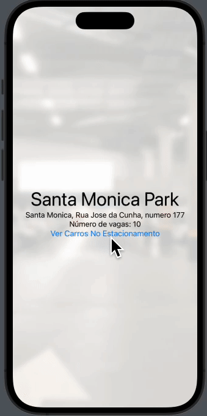

    <section>   
        

                <h2>Desafio 4</h2>
                <h2>Calculadora IMC em Swift</h2>
            
        

        

                <h2>Desafio 7</h2>
                <h2>Nesse desafio, recriei uma visualização do famigerado Spotify</h2>
            
        

        

                <h2>Desafio 8</h2>
                <h2>Nesse desafio, aprimorei meus conhecimentos no uso de mapas em Swift</h2>
            
        

        

                <h2>Desafio 9</h2>
                <h2>Nesse desafio, importei uma API do Valorant, que traz informações dos agentes do jogo, e criei uma interface para um simples aplicativo que permite scrollar os agentes e ao clicar em algum, direciona para uma nova View com uma breve descrição do agente</h2>
            
        

        

                <h2>Desafio 10</h2>
                <h2>Nesse desafio, criei a minha própria API, para gerenciamento de um estacionamento de veículos, usando Node-Red e Postman e fiz a importação da mesma no Swift</h2>
            
        

    </section>

